# 🏨 Hotel Reservation System (PostgreSQL ERD)

A hotel booking database system designed using **PostgreSQL**, structured with an Entity Relationship Diagram (ERD) to manage guests, reservations, payments, room facilities, and hotel staff data efficiently.

---

## 📌 Features

- Guest information management
- Room booking system
- Payment and refund tracking
- Room and facility details
- Relational schema with full foreign key constraints

---

##  Entity Relationship Diagram (ERD)

Here’s the ERD used for this system:

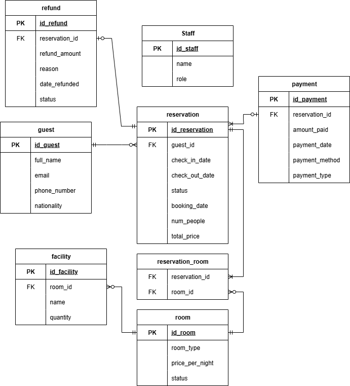 


---

## 🗃️ Table Overview (Schema: `hotel_reservation`)

| Table               | Description                         |
|---------------------|-------------------------------------|
| `guest`             | Stores hotel guest information      |
| `reservation`       | Room reservation data               |
| `room`              | Hotel room list                     |
| `facility`          | Room facilities                     |
| `staff`             | Hotel staff details                 |
| `payment`           | Payment records                     |
| `refund`            | Refund history                      |
| `reservation_room`  | Many-to-many relationship between reservation and room |

---

##  How to Import SQL into PostgreSQL

1. Open DBeaver / pgAdmin or your preferred SQL client  
2. Create a new database (e.g., `hotel_db`)
3. Run the SQL file `database.sql`
4. All tables and sample data will be created under the `hotel_reservation` schema

---

## Database Schema
Here’s the Database Schema used for this system:

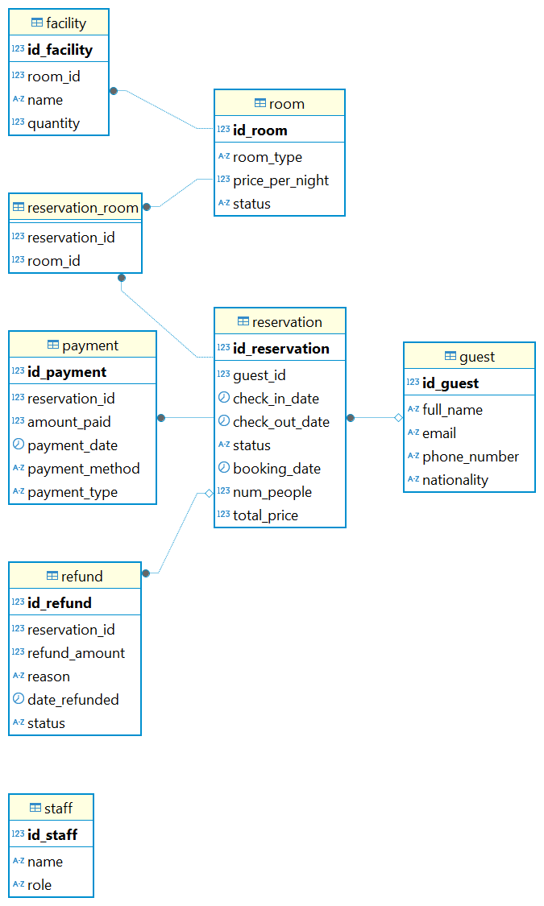 

---

## Example Query

- This query calculates the total revenue for each reservation over the last 3 months, including:
- Guest details
- Payment info
- Refund amount (if any)
- Final net income per reservation

```sql
SELECT 
    g.full_name,
    r.id_reservation,
    r.booking_date,
    r.check_in_date,
    r.check_out_date,
    r.status AS reservation_status,
    p.amount_paid,
    p.payment_method,
    COALESCE(re.refund_amount, 0) AS refund_amount,
    (p.amount_paid - COALESCE(re.refund_amount, 0)) AS net_income
FROM 
    reservation r
JOIN guest g ON r.guest_id = g.id_guest
JOIN payment p ON r.id_reservation = p.reservation_id
LEFT JOIN refund re ON r.id_reservation = re.reservation_id
WHERE 
    r.booking_date >= CURRENT_DATE - INTERVAL '3 months'
ORDER BY 
    r.booking_date DESC;
```
#### Output
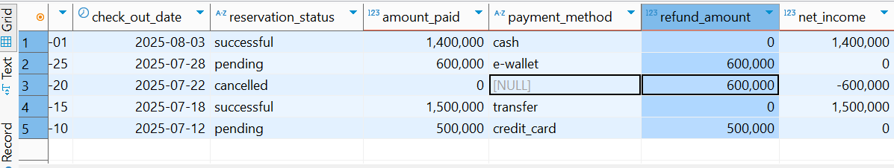 \

---

## Dummy Tables

### Guest Table 
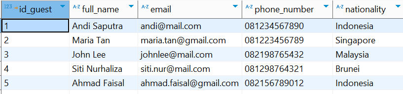

### Reservation Table
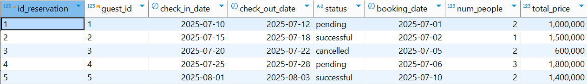

### Room Table
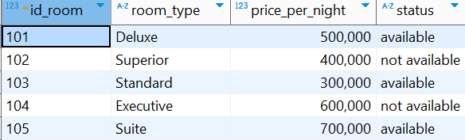

### Facility Table
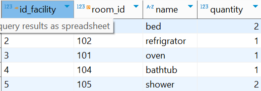

### Reservation Room Table
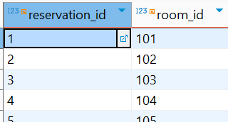

### Payment Table
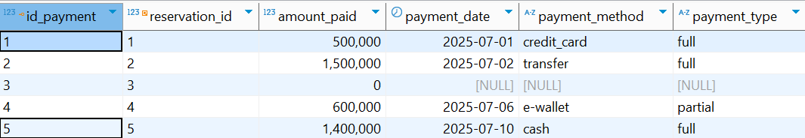

### Refund Table
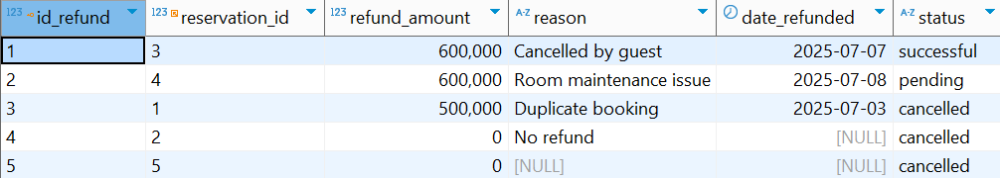

### Staff Table
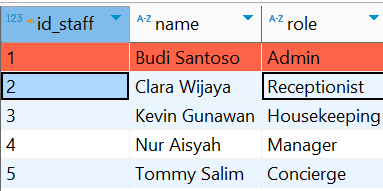

---

## 📞 For further information, contact me on gmail
✉️ rasyidbomantoro@gmail.com
